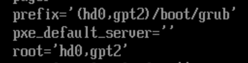

# Corrupt Bootloader config

Completed On: June 4, 2026
Domain: System Management
Last Edited: June 8, 2026 11:18 AM
Objective: Basic-Linux
State: Completed
UUID: df28d449-2163-4729-b6e2-7b5baacccc0f

Modify the grub.cfg file . Observe boot failure and investigate GRUB configuration.

### Change done

Just `echo "" > `/boot/grub/grub.cfg`

### Fix

The fix is performed from the ubuntu liveCD

I was able to acces the shell pressing F2 and mounted the root partition after checking with `lsblk`

```bash
# Mount all the partitions, and virtual filesystems
mount /dev/sda2 /mnt
mount --bind /proc /mnt/proc
mount --bind /sys /mnt/sys
mount --bind /dev /mnt/dev

#This line is necessary because your system is booting in UEFI mode.
mount /dev/sda1 /mnt/boot/efi

#change the root directory.
chroot /mnt
```

<aside>
💡

This is important for the next step which is `chroot` , in which we need the directories inside `/mnt/`  to have access to the liveCD system directories. 

</aside>

```bash
# run update-grub to regenerate the grub.cfg file. 
update-grub

#run install to apply changes /boot/efi/
#grub-install /dev/sda Not really needed for this issue
```

# Extra

- **Is there an actual error to be recorded when the machine boots up with corrupted grub.cfg?**
    - We can see grub variables with `set`
        
        
        
    - We can check the directory and see if the `grub.cfg` file is there
        
        `ls  (hd0,gpt2)/boot/grub`
        
        The file can also be read with `cat` 
        
    - `normal` this attempts to load the normal module `normal.mod` which
    - An existing grub.cfg file can be forcefully loaded with `grub> configfile (hd0,gpt2)/boot/grub/grub.cfg`
- **Is grub-install really need?**
    
    No, it works fine without grub-install
    

# BIOS Variation

[Corrupt Bootloader config-BIOS version](https://app.notion.com/p/Corrupt-Bootloader-config-BIOS-version-3759cd372e978062bc3fecbb1922ee47?pvs=21)