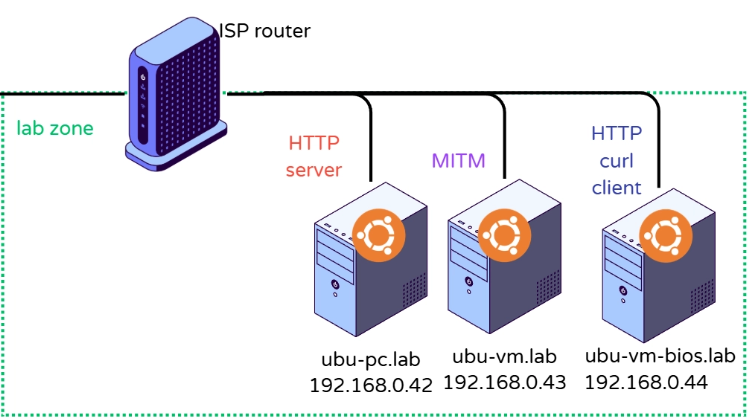

# Kernel parameter misconfiguration via sysctl

Completed On: June 7, 2026
Domain: System Management
Last Edited: June 7, 2026 2:43 PM
Objective: Basic-Linux
State: Completed
UUID: fe25c281-81e4-4bd7-b1d0-23f70916b24e

## Lab Pre-requirements

[Apache-Http](https://app.notion.com/p/Apache-Http-3779cd372e9780848ca9cbaa078e1338?pvs=21) 

This lab requires three machines, one HTTP server, an HTTP Client doing a keepalive `curl` , and third “man in the middle” server. This is already defined on this pre-requisite lab



# Set up

On MITM server

```bash
# Enable IPv4 forwarding
sysctl -w net.ipv4.ip_forward=1
sysctl -p

# Enable firewall level accept
sudo iptables -P FORWARD ACCEPT

# To disable
# sudo iptables -P FORWARD DROP
```

On HTTP client

```bash
#                      v Server        v MITM
sudo ip route add 192.168.0.42 via 192.168.0.43
# If you want to reach the Server, reach it via MITM
```

On HTTP server

```bash
#                    v Client        v MITM
sudo ip route add 192.168.0.44 via 192.168.0.43
# If you want to reach the Client, reach it via MITM
```

<aside>
💡

These routes will be transient as they are not being written on netplan

</aside>

This will make the traffic physically transfer between the MITM server. $^{1}(p.209)$ $^{2}(p.660)$

Without these rules, traffic will just go on the NAT via each server. Interstingly this helps a lot to see the traffic one way , as these routes can be set one at the time and we can see either the response or the answer being re-routed on real time with `sudo tcpdump -i eth0 -nn tcp port 80` on `mitm` server

On client server, we can run a keep alive script, as per [Apache-Http](https://app.notion.com/p/Apache-Http-3779cd372e9780848ca9cbaa078e1338?pvs=21), and we can see the connection react to the changes on forwarding or iptables in MITM server

```bash
14:13:12 — OK —    http server(ubu-pc) is alive   Secret: password123
14:13:13 — OK —    http server(ubu-pc) is alive   Secret: password123
14:13:14 — OK —    http server(ubu-pc) is alive   Secret: password123
14:13:15 — FAILED
14:13:18 — FAILED
14:13:21 — FAILED
14:13:24 — FAILED
14:13:27 — OK —    http server(ubu-pc) is alive   Secret: password123
14:13:28 — OK —    http server(ubu-pc) is alive   Secret: password123
```

With the keep alive set up we can break the forwarding by just editing

```bash
# Enable IPv4 forwarding
sysctl -w net.ipv4.ip_forward=0
sysctl -p
```

Completing the lab.

## Resources

[1] [Linux Basics For Hackers](https://app.notion.com/p/Linux-Basics-For-Hackers-3759cd372e9780949a29df8500029df6?pvs=21) 

[2] [CompTIA Linux+™ Certification All-in-One Exam Guide, Second Edition (Exam XK0-005)](https://app.notion.com/p/CompTIA-Linux-Certification-All-in-One-Exam-Guide-Second-Edition-Exam-XK0-005-3789cd372e9780fd9dace11c1e037f8e?pvs=21)