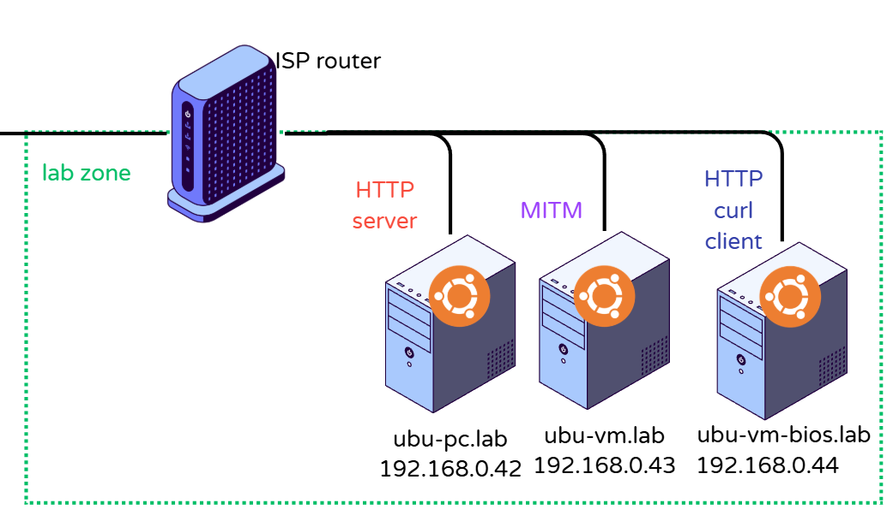

# Apache-Http

Completed On: June 6, 2026
Domain: Services and User Management
Last Edited: June 7, 2026 11:30 AM
Objective: Basic-configurations-of-Common-services
State: Completed
UUID: bb9a08f2-8ce7-40f0-aca4-7962248c28f8

On `SERVER`

1. Set up Apache
    
    ```bash
    #!/usr/bin/env bash
    
    if [ -z "$SUDO_USER" ]; then
    echo "Run with sudo"
    exit 1
    fi
    
    apt install -y apache2
    systemctl enable --now apache2
    
    cat > /var/www/html/index.html << 'EOF'
    <!DOCTYPE html>
    <html>
    <head><title>Lab Server</title></head>
    <body>
    <h1>http server(ubu-pc) is alive</h1>
    <p>Secret: password123</p>
    </body>
    </html>
    EOF
    
    ufw allow 80/tcp
    ufw reload
    ```
    

After this I can confirm that the http page loads on my PC. 

Next step is calling the server via curl.

In this case the “client” will be `ubu-vm-bios.lab`

1. On `CLIENT` Configure keepalive loop

```bash
#!/usr/bin/env bash

while true; do
  TIMESTAMP=$(date '+%H:%M:%S')
  RESPONSE=$(curl -s --max-time 2 http://ubu-pc.lab/)
  if [ $? -eq 0 ]; then
	FRAGMENT=$(echo "$RESPONSE" |
    	sed -n '/<body>/,/<\/body>/p' |
    	sed 's/<[^>]*>//g' |
    	tr '\n' ' ')
    echo "$TIMESTAMP — OK — $FRAGMENT"
  else
    echo "$TIMESTAMP — FAILED"
  fi
  sleep 1
done

```

Sample:

```bash
14:32:01 — OK — <body>  <h1>demo2 is alive</h1>  <p>Secret: pa
14:32:02 — OK — <body>  <h1>demo2 is alive</h1>  <p>Secret: pa
14:32:03 — FAILED
14:32:04 — FAILED
14:32:05 — OK — <body>  <h1>demo2 is alive</h1>  <p>Secret: pa
```

### Lab Topology



# References

[Apache Docs](https://app.notion.com/p/Apache-Docs-3789cd372e97803f9640e379bbf92752?pvs=21) 

[Compiling and Installing](https://httpd.apache.org/docs/2.4/install.html#:~:text=Installing%20on%20Ubuntu/Debian)
[Getting Started-Web Site Content](https://httpd.apache.org/docs/current/getting-started.html#:~:text=htaccess%20howto.-,Web%20Site%20Content%20%C2%B6,-Web%20site%20content)